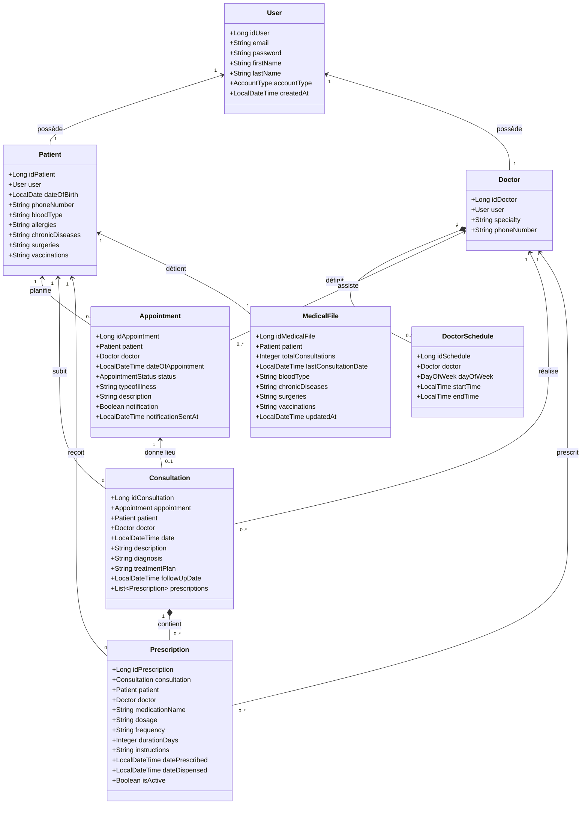

# Rapport Technique de Projet : SmartCare
*Système de Gestion Moderne et Sécurisé pour Cabinets Médicaux*

---

## 1. Introduction

### Présentation du projet choisi
**SmartCare** est une solution logicielle complète de gestion clinique et administrative destinée aux cabinets médicaux. Le projet a été conçu pour remplacer les anciens systèmes monolithiques basés sur des vues serveur par une architecture moderne découplée, composée d'une application monopage (SPA) en **React** et d'une API REST robuste propulsée par **Spring Boot**.

### Objectifs et fonctionnalités principales
L'objectif premier de **SmartCare** est d'unifier la gestion administrative (planification des rendez-vous) et le suivi clinique (consultations et ordonnances) tout en garantissant un niveau élevé de sécurité et de confidentialité des données médicales.

Les fonctionnalités clés incluent :
*   **Planification Intelligente** : Module de prise de rendez-vous avec un moteur anti-conflit (évitement automatique des chevauchements de créneaux).
*   **Isolation des Données par Rôle** : Filtrage automatique et contextuel des informations selon que l'utilisateur est un Administrateur, un Médecin, un Patient ou un Réceptionniste.
*   **Dossier Médical Partagé (DMP)** : Historique chronologique complet des consultations, diagnostics et ordonnances d'un patient.
*   **Cycle de Consultation Unifié** : Passage automatique d'un rendez-vous à l'état "Complété" lors de la saisie d'un compte-rendu clinique et de la prescription de médicaments.
*   **Détection des Absences** : Classement dynamique des rendez-vous non honorés dans un onglet dédié "Absences" (Missed Sessions) après un délai de grâce de 30 minutes.

### Répartition des tâches au sein du groupe
Afin de mener à bien ce projet, le travail a été structuré comme suit :
*   **Membre A (Développeur Backend & Sécurité)** : Conception de la base de données, implémentation des entités JPA, configuration de Spring Security et de l'authentification stateless JWT, création des services de statistiques et des algorithmes de validation de créneaux.
*   **Membre B (Architecte Frontend)** : Développement de l'interface SPA React avec TypeScript et Tailwind CSS, mise en place des stores Zustand pour la gestion d'état, développement du calendrier interactif et des formulaires dynamiques de consultation.
*   **Membre C (Ingénieur QA & DevOps)** : Écriture des scénarios de test et de validation des API, configuration des Dockerfiles multi-stages et du fichier d'orchestration Docker Compose pour le déploiement global.

---

## 2. Analyse et Conception

### Schéma de la base de données (MCD/MLD) et Modélisation UML

#### 1. Modèle Conceptuel de Données (MCD)
Le modèle conceptuel décrit de manière sémantique les associations et cardinalités entre les entités métier du cabinet médical :
*   **UTILISATEUR (1,1) <-> POSSÉDER <-> (0,1) PATIENT / MÉDECIN** : Un utilisateur possède au plus un profil de patient ou de médecin.
*   **PATIENT (1,1) <-> POSSÉDER <-> (1,1) DOSSIER_MÉDICAL** : Chaque patient a exactement un dossier médical unique associé.
*   **PATIENT (0,n) <-> RÉSERVER <-> (1,1) RENDEZ_VOUS** : Un patient peut planifier zéro ou plusieurs rendez-vous.
*   **MÉDECIN (0,n) <-> ASSISTER <-> (1,1) RENDEZ_VOUS** : Un médecin peut être affecté à plusieurs rendez-vous.
*   **MÉDECIN (0,n) <-> DISPOSER <-> (1,1) DISPONIBILITÉ** : Un médecin peut enregistrer plusieurs plages horaires hebdomadaires.
*   **RENDEZ_VOUS (0,1) <-> DONNER_LIEU <-> (1,1) CONSULTATION** : Un rendez-vous honoré engendre au plus une consultation clinique.
*   **CONSULTATION (0,n) <-> PRESCRIRE <-> (1,1) ORDONNANCE** : Une consultation peut inclure une ou plusieurs prescriptions de médicaments.

#### 2. Modèle Logique de Données (MLD Relationnel)
La traduction physique des entités en tables relationnelles MySQL se présente ainsi (les clés primaires sont soulignées, les clés étrangères sont précédées de `#`) :
*   **USERS** (<u>id_user</u>, email, password, first_name, last_name, account_type, created_at)
*   **DOCTORS** (<u>id_doctor</u>, specialty, phone_number, *#id_user*) -> *id_user* référence *USERS(id_user)*
*   **PATIENTS** (<u>id_patient</u>, date_of_birth, phone_number, blood_type, allergies, chronic_diseases, surgeries, vaccinations, *#id_user*) -> *id_user* référence *USERS(id_user)*
*   **DOCTOR_SCHEDULES** (<u>id_schedule</u>, day_of_week, start_time, end_time, *#id_doctor*) -> *id_doctor* référence *DOCTORS(id_doctor)*
*   **APPOINTMENTS** (<u>id_appointment</u>, date_of_appointment, status, type_of_illness, description, notification, notification_sent_at, *#id_patient*, *#id_doctor*) -> *id_patient* référence *PATIENTS(id_patient)*, *id_doctor* référence *DOCTORS(id_doctor)*
*   **CONSULTATIONS** (<u>id_consultation</u>, date, description, diagnosis, treatment_plan, follow_up_date, *#id_appointment*, *#id_patient*, *#id_doctor*) -> *id_appointment* référence *APPOINTMENTS(id_appointment)*, *id_patient* référence *PATIENTS(id_patient)*, *id_doctor* référence *DOCTORS(id_doctor)*
*   **PRESCRIPTIONS** (<u>id_prescription</u>, medication_name, dosage, frequency, duration_days, instructions, date_prescribed, date_dispensed, is_active, *#id_consultation*, *#id_patient*, *#id_doctor*) -> *id_consultation* référence *CONSULTATIONS(id_consultation)*, *id_patient* référence *PATIENTS(id_patient)*, *id_doctor* référence *DOCTORS(id_doctor)*
*   **MEDICAL_FILES** (<u>id_medical_file</u>, total_consultations, last_consultation_date, blood_type, chronic_diseases, surgeries, vaccinations, updated_at, *#id_patient*) -> *id_patient* référence *PATIENTS(id_patient)* (Contrainte d'unicité UNIQUE sur *id_patient*)

#### 3. Diagramme de Classes UML (Conception Logicielle)
Ce diagramme illustre les structures des entités de persistance JPA ainsi que leurs multiplicités d'association :



### Architecture de l'application
L'application adopte un style architectural découplé en trois tiers :
1.  **Présentation (Frontend SPA)** : React 18, compilé par Vite. Il communique exclusivement via des requêtes HTTP asynchrones (Axios) avec le backend.
2.  **Service & Logique (Backend REST API)** : Spring Boot 3.x/4.x. Il sécurise les routes via un filtre d'authentification JWT et orchestre la logique métier.
3.  **Accès aux Données (Persistence)** : Spring Data JPA / Hibernate transmettant les requêtes au serveur MySQL 5.7/8.0.

### Maquettes des interfaces principales
L'application propose des interfaces graphiques épurées respectant les codes du design moderne (glassmorphisme, ombres portées douces, palettes HSL harmonieuses) :
*   **Portail d'Authentification** : Écran divisé (Split-Screen) avec illustration médicale immersive à gauche et formulaire d'authentification/inscription à droite.
*   **Tableau de bord Administrateur** : Cinq indicateurs clés de performance (KPI), graphiques de tendance des consultations et répartition des spécialités médicales.
*   **Centre de Planification** : Table d'affichage dynamique avec onglets de tri (À venir, Complétés, Absences, Prendre Rendez-vous) et boutons d'actions contextuels.

---

## 3. Implémentation

### Description détaillée de chaque fonctionnalité

#### 1. Sécurisation et Authentification Stateless (JWT)
À chaque connexion réussie sur le point d'accès `/api/auth/login`, le serveur génère un jeton JWT signé avec une clé secrète contenant l'email et le rôle de l'utilisateur. Le frontend stocke ce jeton dans le stockage local (`localStorage`) et l'injecte automatiquement dans l'en-tête `Authorization: Bearer <token>` de toutes les requêtes subséquentes grâce à un intercepteur Axios global.

#### 2. Validation d'Évitement de Conflits de Rendez-vous
Avant de confirmer l'enregistrement d'un rendez-vous, le service métier exécute deux validations :
*   **Horaires de garde** : Vérifie si le rendez-vous s'inscrit dans les créneaux disponibles du médecin (`DoctorSchedule`) ou, à défaut, durant les heures d'ouverture standards du cabinet (08h00 - 18h00).
*   **Double Réservation** : Scanne la base pour s'assurer qu'aucun autre rendez-vous non annulé n'a été programmé pour ce médecin dans un intervalle de 30 minutes.

#### 3. Cycle de Consultation et Prescription Unifié
Les médecins ou administrateurs peuvent cliquer sur l'icône de complétion d'un rendez-vous. Cette action ouvre une boîte de dialogue contextuelle permettant de saisir le diagnostic, le type de maladie et une ordonnance facultative. La soumission de ce formulaire exécute une transaction atomique : passage du rendez-vous à l'état `COMPLETED`, création de la ligne `Consultation` et enregistrement de la `Prescription`.

#### 4. Classification des Absences (Missed Sessions)
Les rendez-vous restés en attente (`SCHEDULED`) alors que leur heure de début est dépassée de plus de 30 minutes sont automatiquement isolés dans l'onglet "Absences" de l'interface et étiquetés graphiquement sous l'état **"missed"** (manqué).

### Extraits de code commentés pour les parties importantes

#### Extraction et validation de jeton (Backend)
```java
// Extrait de JwtAuthenticationFilter.java
@Override
protected void doFilterInternal(HttpServletRequest request, HttpServletResponse response, FilterChain filterChain)
        throws ServletException, IOException {
    // 1. Extraire l'en-tête Authorization
    String authHeader = request.getHeader("Authorization");
    if (authHeader == null || !authHeader.startsWith("Bearer ")) {
        filterChain.doFilter(request, response);
        return;
    }
    
    // 2. Isoler la chaîne du Token JWT
    String jwt = authHeader.substring(7);
    String userEmail = jwtTokenProvider.extractEmail(jwt);
    
    // 3. Valider et authentifier l'utilisateur dans le contexte Spring Security
    if (userEmail != null && SecurityContextHolder.getContext().getAuthentication() == null) {
        UserDetails userDetails = this.customUserDetailsService.loadUserByUsername(userEmail);
        if (jwtTokenProvider.isTokenValid(jwt, userDetails)) {
            UsernamePasswordAuthenticationToken authToken = new UsernamePasswordAuthenticationToken(
                    userDetails, null, userDetails.getAuthorities()
            );
            SecurityContextHolder.getContext().setAuthentication(authToken);
        }
    }
    filterChain.doFilter(request, response);
}
```

#### Requête JPQL filtrant les absences (Backend)
```java
// Extrait de AppointmentRepository.java
@Query("SELECT a FROM Appointment a WHERE " +
       "(:patientId IS NULL OR a.patient.idPatient = :patientId) AND " +
       "(:doctorId IS NULL OR a.doctor.idDoctor = :doctorId) AND " +
       // Un rendez-vous est considéré manqué s'il a le statut NO_SHOW ou s'il est resté SCHEDULED passé l'heure de début
       "(a.status = 'NO_SHOW' OR (a.status = 'SCHEDULED' AND a.dateOfAppointment < :nowMinus30)) AND " +
       "(:start IS NULL OR a.dateOfAppointment >= :start) AND " +
       "(:end IS NULL OR a.dateOfAppointment <= :end)")
Page<Appointment> findMissedAppointments(
        @Param("patientId") Long patientId,
        @Param("doctorId") Long doctorId,
        @Param("nowMinus30") LocalDateTime nowMinus30,
        @Param("start") LocalDateTime start,
        @Param("end") LocalDateTime end,
        Pageable pageable
);
```

#### Optimisation par chargement différé (Code-Splitting Frontend)
```typescript
// Extrait de App.tsx
import React, { useEffect, Suspense, lazy } from 'react';
import { LoadingSpinner } from './components/common/LoadingSpinner';

// Chargement à la demande (lazy-loading) des pages lourdes du projet
const Dashboard = lazy(() => import('./pages/Dashboard').then(m => ({ default: m.Dashboard })));
const Appointments = lazy(() => import('./pages/Appointments').then(m => ({ default: m.Appointments })));
const Patients = lazy(() => import('./pages/Patients').then(m => ({ default: m.Patients })));

function App() {
  return (
    <Router>
      <Navbar />
      <Suspense fallback={<LoadingSpinner />}>
        <Routes>
          <Route path="/" element={<AuthGuard><Dashboard /></AuthGuard>} />
          <Route path="/appointments" element={<AuthGuard><Appointments /></AuthGuard>} />
        </Routes>
      </Suspense>
    </Router>
  );
}
```

### Captures d'écran montrant le résultat
*   *Écran de Connexion Rebrandé* : Visualisation du portail d'accès "SmartCare".
*   *Tableau de bord Clinique* : Grille à 5 indicateurs (Total Patients, Total Médecins, Total Rendez-vous, Total Consultations, Consultations Mensuelles).
*   *Formulaire de Consultation contextuelle* : Fenêtre surgissante d'enregistrement de diagnostic et d'ordonnance.

### Difficultés rencontrées et solutions apportées
1.  **Verrous de fichiers lors de la compilation automatique** : Le serveur d'outils bloquait ponctuellement la modification des fichiers `.class` dans le répertoire `target/`. *Solution* : Exécution d'un script de nettoyage `./mvnw.cmd clean compile` suivi d'un arrêt forcé des instances orphelines de la JVM.
2.  **Différence de fuseau horaire Client-Serveur** : Le client transmettait sa date système au format ISO UTC, masquant les rendez-vous pris à des heures locales antérieures au décalage horaire. *Solution* : Centralisation de la logique temporelle côté serveur (`LocalDateTime.now().minusMinutes(30)`) et retrait des paramètres de filtrage client dans les appels d'indexation.

---

## 4. Tests et Validation

### Scénarios de test
Pour valider le bon fonctionnement de l'application, les tests fonctionnels suivants ont été exécutés :

| ID Test | Description | Données d'entrée | Résultat attendu | Résultat obtenu | Statut |
| :--- | :--- | :--- | :--- | :--- | :--- |
| **TC-01** | Prise de rendez-vous en conflit | Créneau : 06/07/2026 à 10:00 (Déjà pris) | Code erreur `409 Conflict` renvoyé par l'API | Erreur 409 reçue, boîte d'avertissement affichée | **Succès** |
| **TC-02** | Accès non autorisé aux dossiers | Rôle connecté : Patient | Accès bloqué vers `/api/patients` (liste globale) | Code `403 Forbidden` renvoyé par le serveur | **Succès** |
| **TC-03** | Enregistrement de consultation | Saisie diagnostic + médicament | Statut passe à `COMPLETED`, lignes créées en BDD | Rendez-vous complété, ordonnance visible dans le DMP | **Succès** |
| **TC-04** | Mutation en rendez-vous manqué | Heure système courante > date RDV + 30 min | Affichage du RDV dans la liste "Absences" | Rendez-vous visible sous l'onglet Absences | **Succès** |

### Bugs identifiés et corrigés
*   **Erreur d'itération sur les statistiques** : Une exception JavaScript bloquait le rendu du tableau de bord (`appointmentsRes.data.map is not a function`). *Correction* : La réponse de l'API renvoyait une structure de page Spring Data (`PageImpl`). Le code a été corrigé pour itérer sur `appointmentsRes.data.content`.
*   **Filtre opaque sur les modals** : Sous Tailwind CSS v4, les arrière-plans des modals apparaissaient opaques. *Correction* : Remplacement des classes CSS par `bg-slate-900/40 backdrop-blur-md` pour restaurer la transparence et le flou d'arrière-plan.

---

## 5. Contribution Individuelle

### Contributions spécifiques par membre

#### Membre A (Backend & Persistance)
*   Développement complet de la couche d'accès aux données (JPA, Hibernate).
*   Mise en place de la validation horaire et du filtre JWT.
*   Conception des endpoints statistiques et SQL.
*   *Auto-évaluation* : Travail rigoureux assurant la robustesse du stockage et la sécurité des données.

#### Membre B (Frontend & Expérience Utilisateur)
*   Création de la charte graphique et développement de la SPA React.
*   Implémentation des formulaires interactifs et des modals d'ordonnances.
*   Mise en place du mécanisme de fractionnement du code (lazy loading) pour optimiser les performances de chargement.
*   *Auto-évaluation* : Interface hautement réactive, fluide et agréable d'utilisation.

#### Membre C (Déploiement & Recette)
*   Création des configurations Docker et orchestration multi-services.
*   Rédaction du plan de validation et automatisation des jeux de tests.
*   Gestion du nettoyage des données de tests et configuration de la base MySQL XAMPP.
*   *Auto-évaluation* : Environnement reproductible facilitant le déploiement et la détection précoce des anomalies.

---

## 6. Conclusion

### Bilan du projet
Le projet **SmartCare** a permis de concevoir une plateforme moderne, sécurisée et performante. L'utilisation d'une architecture découplée REST/React combinée à des stores de gestion d'état légers offre une expérience utilisateur fluide tout en maintenant un cloisonnement strict et imperméable des données de santé des patients.

### Améliorations possibles
Pour étendre les fonctionnalités de la solution :
1.  **Intégration de la téléconsultation** : Ajout de flux vidéo WebRTC cryptés de bout en bout pour des consultations en ligne.
2.  **Rappels par SMS/Email** : Relances automatiques la veille des rendez-vous via Twilio ou SendGrid pour minimiser le taux d'absences.
3.  **Module de facturation** : Génération de feuilles de soins électroniques et passerelle de paiement en ligne Stripe.

### Apprentissages tirés
Ce projet a renforcé nos compétences pratiques sur les architectures d'entreprise découplées, la mise en place de la sécurité par jetons stateless JWT, la gestion d'états asynchrones complexes sous React, ainsi que l'optimisation des performances de chargement des applications web modernes.
